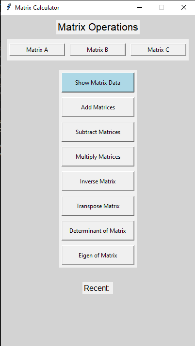
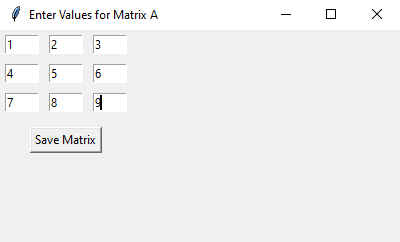
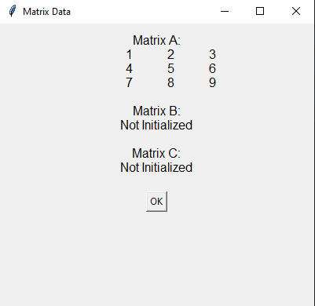

# Matrix Calculator
This project is a Matrix Calculator implemented in Python using the tkinter library for the graphical user interface (GUI) and numpy for matrix operations. It allows users to perform various matrix operations such as addition, subtraction, multiplication, inverse, transpose, determinant, and eigenvalue calculations.

## Features
- Matrix Input: Users can input matrices of custom sizes using a grid-based interface.
- Matrix Operations:
  - Addition
  - Subtraction
  - Multiplication
  - Inverse
  - Transpose
  - Determinant
  - Eigenvalues and Eigenvectors
- User-Friendly Interface: Built with tkinter, the GUI is intuitive and easy to use.
- Error Handling: Ensures valid inputs and provides meaningful error messages.
- Hover Effects: Buttons have hover effects for better user interaction.

## Requirements
- Python 3.12.0
- numpy: For matrix operations.
- tkinter: For the graphical user interface (usually comes pre-installed with Python)

## Installation
```bash
git clone https://github.com/kitarp3690/Matrix_Operations_Numpy.git
```
```bash
pip install numpy
```
```bash
cd Matrix_Operations_Numpy
```
```bash
python main.py
```
    
## Usage/Examples
1. Launch the Application:  
   - Run the script main.py to start the Matrix Calculator.
2. Input Matrices:
   - Click on the buttons Matrix A, Matrix B, or Matrix C to input matrices.
   - Enter the size of the matrix in the format rows,columns (e.g., 2,3 for a 2x3 matrix).
   - Fill in the grid with the matrix values and click Save Matrix.
3. Perform Operations:
    - Use the buttons in the GUI to perform operations like addition, subtraction, multiplication, inverse, transpose, determinant, and eigenvalue calculations.
    - Follow the prompts to select matrices and view the results.
4. View Results:
    - Results are displayed in a pop-up window and also shown in the Recent section of the main window.

## How it works
- Matrix Input:  
    - Users can input matrices of any size using a grid of tkinter.Entry widgets.
    - The input is validated to ensure it contains only integers.
- Matrix Operations:  
    - Addition/Subtraction: Matrices are added or subtracted element-wise. The program ensures that the matrices have the same dimensions.
    - Multiplication: Matrices are multiplied using numpy.dot(). The program ensures that the number of columns in the first matrix matches the number of rows in the second matrix.
    - Inverse: The inverse of a matrix is calculated using numpy.linalg.inv(). The program ensures the matrix is square and invertible.
    - Transpose: The transpose of a matrix is calculated using numpy.transpose().  
    - Determinant: The determinant of a matrix is calculated using numpy.linalg.det().
    - Eigenvalues and Eigenvectors: Calculated using numpy.linalg.eig().
### GUI Design:
- The GUI is built using tkinter and includes buttons, labels, and frames for a clean and organized layout.
- Hover effects are added to buttons for better user interaction.

# Screenshot




## Acknowledgements
- numpy: For efficient matrix operations.
- tkinter: For building the graphical user interface.
- Inspired by educational tools for linear algebra and matrix calculations.
- Thanks to contributors and the Python community for the great libraries and tools!

## Contact Information
For any questions, feel free to contact me via GitHub or at my email: pratikshrestha362@gmail.com.

## Author
- [Pratik Shrestha](https://www.github.com/kitarp3690)

